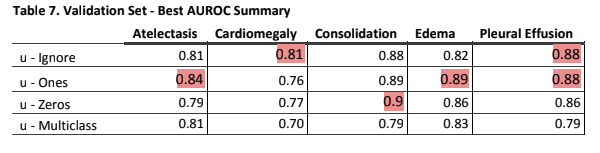
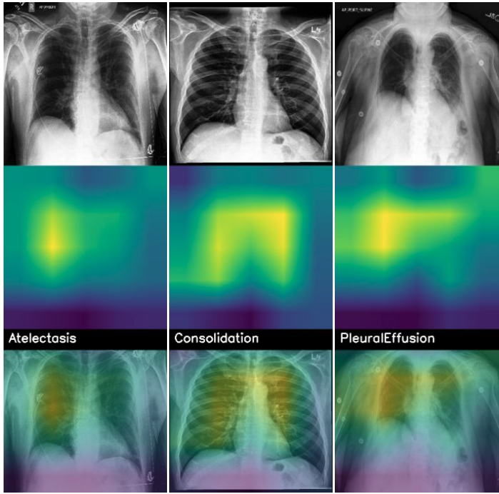
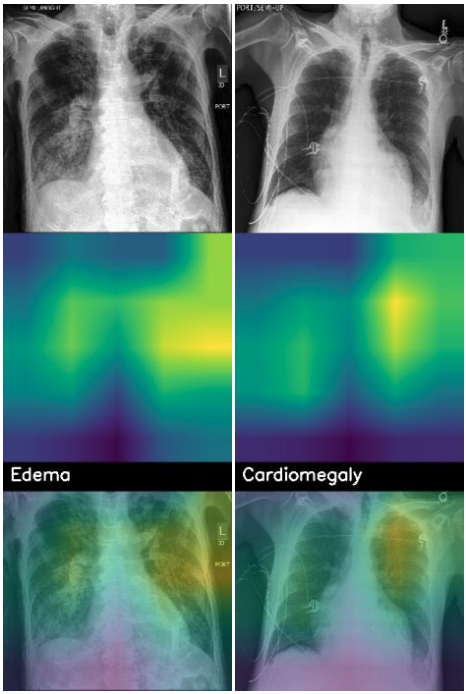

#                                              Chest X-Ray Disease Diagnosis


## Introduction
This project is a experiment to improve ChexPert accuracy by fine-tune DenseNet121 on ChexNet weight. 

## Environment Specification


Exploratory Data Analysis-  PySpark in Domino data-lab. 
ML - Python 3.6 w Tensorflow GPU+ Keras APIs on local machines with GPU and Azure VM with GPU. 

**Dataset Utilized**: Low resolution ( 11 GB )

**Training Time** - 12 hours on Azure GPU VM; 3 to 4 hours on local machines with GPU.

**Library dependencies** -  environment.yml. 

**Data source**: https://stanfordmlgroup.github.io/competitions/chexpert/ 

**CheXnet weights**: https://drive.google.com/open?id=1hTtFc7ig_OiI_aFju4DAbVNV7s3zBAtq <br>
    -CITATION: Chexnet DenseNet121 weights from here: https://github.com/brucechou1983/CheXNet-Keras


## Model Inference
Steps to use the model built for Inference:

  1) Place the Xray files for Inference in infer folder along side train folder and the inference.csv in the same format as train.csv
  
  2) Start a flask API hosted on your local machine by running "python CheXRay_API.py"
  
  3) listen to requests with the approach ( u-Ones, U-Zeros, etc)
  
  4) load the appropriate model based on the approach in memory
  
  5) Run "pythonCheXRay_predict_request" to send the approach to the API interface
  
  6) predict the pathologies in the inference X-Ray images ; predictions get saved under resources folder


From the project root folder run the below python files in order:
```

CheXRay_API.py
CheXRay_predict_request.py

```
## EDA 

 ```
     01_ExploratoryDataAnalysis.ipynb    
     
 ```
 - Label distribution: 
 


## Model Training
Here are the steps followed to create and train the model:

- Step 1:
  Use above mentioned data source link to download the data and unzip the data along side the project root directory.


- Step 2: Choose appropriate hyperparameters such as batch_size, learning rate, epochs, image size , approach, whether to fine tune or not, use DenseNet or EfficientNet, use ImageNet or CheXnet weights in the below file:


 ```
    src\config.py    
    
 ```


- Step 3:
Train Deep Learning Model, and Validate Model; run Model for different epochs and modify hyper parameters to tune Model Performance.  


The jupyter notebook code used for training data set:

 ```
     03_Train_Test.ipynb    
     
 ```

- Step 4:
Evaluate Model Performance using Confusion Matrix, AUC/ROC Curve & Precision Recall Curve. In  03_Train_Test.ipynb 


## Result - 



## Visualization - Gradient Class Activation Maps

Here are the steps to generate the Grad-CAMs for a chosen model:

- Step 1:
Open 03_Visualization_ClassActivationMaps.ipynb

- Step 2:
Change the model_path variable so that it contains the file path to the saved model.h5 file for which you want to generate CAMs for

- Step 3:
Run the notebook


